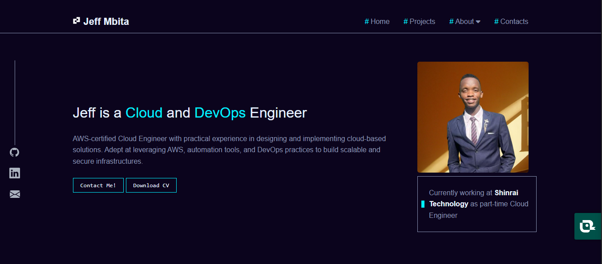

# 🌟 Jeff Mbita - 2025 Portfolio

<div align="center">
  
</div>

## 📌 Table of Contents
- [Project Overview](#-project-overview)
- [Features](#-features)
- [Tech Stack](#-tech-stack)
- [Hackathon Requirements](#-hackathon-requirements)
- [Installation](#-installation)
- [Collaboration](#-collaboration)
- [License](#-license)

## 🚀 Project Overview
Professional portfolio website showcasing my cloud engineering skills, projects, and certifications. Created for the **PLP Academy Feb 2025 Hackathon** to demonstrate:
- AWS cloud architecture expertise
- DevOps implementation skills
- Responsive web design principles

## ✨ Features
| Feature          | Description                                                                 |
|------------------|-----------------------------------------------------------------------------|
| **Responsive Design** | Optimized for all devices (mobile, tablet, desktop)                       |
| **Project Showcase**  | Interactive project cards with technologies used and live demos            |
| **Skills Matrix**    | Categorized cloud engineering skills with visual indicators               |
| **Contact Form**     | Functional form with Formspree integration                                |
| **Downloadable CV**  | Direct PDF download of professional resume                                |

## 🛠️ Tech Stack
**Frontend:**
- HTML5 (Semantic markup)
- CSS3 (Flexbox, Grid, Variables)
- JavaScript (DOM manipulation)

**DevOps:**
- GitHub Pages (Hosting)
- Git (Version control)

**Design:**
- Font Awesome (Icons)
- Google Fonts (Typography)

## 📋 Hackathon Requirements Checklist
| Requirement            | Implementation Status | Notes                          |
|------------------------|-----------------------|--------------------------------|
| Programming Languages  | ✅ Completed          | HTML/CSS/JS                    |
| About Section          | ✅ Completed          | Detailed professional bio      |
| Education + CV         | ✅ Completed          | Downloadable PDF included      |
| Interests              | ✅ Completed          | Cloud technologies focus       |
| Projects               | ✅ Completed          | 3+ projects with case studies  |
| Contact Form           | ✅ Completed          | Formspree integration          |

## 💻 Installation
1. Clone the repository:
   ```bash
   git clone https://github.com/Mbitajeff/My-Portfolio-Website-2025.git
   ```
2. Navigate to project directory:
   ```bash
   cd My-Portfolio-Website-2025
   ```
3. Open in browser:
   ```bash
   open index.html  # macOS
   start index.html # Windows
   xdg-open index.html # Linux
   ```

## 👥 Collaboration
### Peer Group Contributions
Special thanks to my **PLP Academy Peer Group** for their valuable feedback:
- **Nungari**: Suggested improvements to skills section layout
- **Elly**: Reviewed color contrast for accessibility

### Collaboration Evidence
- [GitHub Issue #1: Project card feedback](https://github.com/Mbitajeff/My-Portfolio-Website-2025/issues/1)
- [Pull Request #2: CSS optimization](https://github.com/Mbitajeff/My-Portfolio-Website-2025/pull/2)

## 🌐 Live Deployment
Access the live portfolio:  
[https://mbitajeff.github.io/My-Portfolio-Website-2025](https://mbitajeff.github.io/My-Portfolio-Website-2025)

## 📄 License
This project is licensed under the [MIT License](LICENSE).

---

<div align="center">
  <p>🔗 Connect with me: <a href="mailto:Jeffmbita69@gmail.com">Email</a> | <a href="https://linkedin.com/in/jeffmbita">LinkedIn</a> | <a href="https://github.com/Mbitajeff">GitHub</a></p>
  <p>© 2025 Jeff Mbita | PLP Academy Hackathon Submission</p>
</div>
```